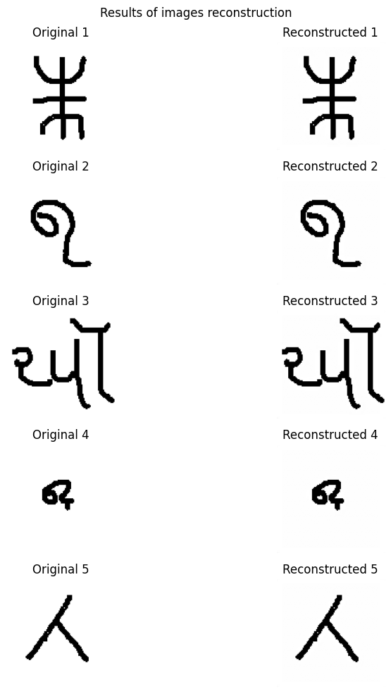

# Autoencoder Implementation with PyTorch

This project details the implementation of a convolutional autoencoder in PyTorch using the Omniglot dataset. The primary goal is to use the encoder-decoder architecture to compress the images into a low-dimensional latent space (latent space) and reconstruct them to be as close as possible to the original images.

## Hyperparameters
The following hyperparameters were used during the training process:

| **Hyperparameter** | **Value**                  |
|---------------------|----------------------------|
| `num_epochs`        | 3                          |
| `batch_size`        | 64                         |
| `optimizer`         | Adam                       |
| `learning_rate`     | 1e-3                       |
| `weight_decay`      | 1e-5                       |

## Results
Below is a glimpse at the results obtained after training:

## Final Epoch Losses
The training and test losses at the final epoch  (using the Mean Squared Error) are summarized below:

| **Metric**        | **Value**                       |
|--------------------|---------------------------------|
| `Training Loss`    | $1.933 \times 10^{-5}$        |
| `Test Loss`        | $1.484 \times 10^{-5}$      |

